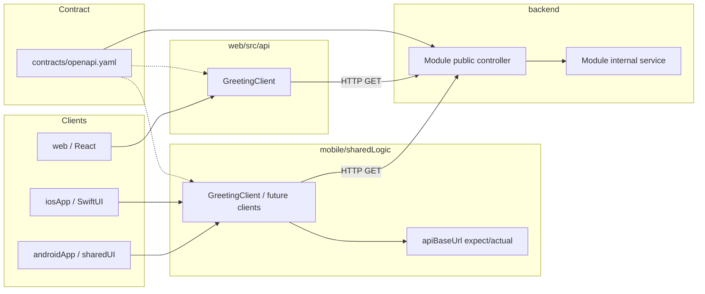

# Architecture

Long-lived design decisions for quickapp. Feature-specific detail lives in
`docs/specs/`; this document explains *how the repo is organized* and *how work
flows through it*.

## What this repo is

quickapp is an **SDD (spec-driven development) starter template**, not a shipped
product. Create a new GitHub repository from this template for each real app
(see `docs/using-as-template.md`). The `greeting` backend module and demo UIs are
disposable harnesses that prove the toolchain. Real apps reuse the same patterns:
roadmap → spec → contract → backend module → mobile/web clients → native or
browser UI.

Three checkpoints are verified in git:

| Checkpoint | Proves |
|------------|--------|
| 1 | Gradle + Spring Modulith backend (Java 25, `ModularityTests`) |
| 2 | KMP `sharedLogic` callable from native Android and iOS |
| 3 | Full cross-stack path: OpenAPI → REST endpoint → Ktor client → native UI |

Web (`web/`) is a fourth consumer of the same OpenAPI contract (React harness +
path-filtered CI). See `docs/specs/archive/kmp-networking-spike.md` for
checkpoint 3 evidence.

## Repository layout

```
quickapp/
├── backend/              # Spring Boot app + Modulith modules (root Gradle build)
│   └── modules/*         # One folder = one vertical slice (auto-discovered)
├── mobile/               # Separate Gradle build (KMP)
│   ├── sharedLogic/      # Shared business logic + networking
│   ├── sharedUI/         # Compose Multiplatform (Android uses this today)
│   ├── androidApp/       # Jetpack Compose shell
│   └── iosApp/           # Native SwiftUI shell (Xcode project)
├── contracts/
│   └── openapi.yaml      # API source of truth
├── build-logic/          # Backend convention plugins
├── docs/
│   ├── architecture.md   # ← this file
│   ├── using-as-template.md
│   ├── roadmap.md        # product backlog (empty on the template)
│   └── specs/            # planned/ + active/ + archive/
└── web/                  # Vite + React + TypeScript (npm; separate from Gradle)
```

**Two independent Gradle builds** plus a separate **npm** web app, one git repo.
Backend root is the repo root; mobile is under `mobile/`; web is under `web/`.
Gradle builds share no Gradle code with each other or with web — only
`contracts/openapi.yaml` connects them.

## SDD workflow

`main` is protected: work lands only via pull request. **One active spec → one
feature branch → one PR.**

Large product ideas go through the **roadmap** first; implementable slices still
use `/spec`.

```
/roadmap (optional carve-up / re-rank)
  →  /spec (on a feature branch)  →  /implement (one task at a time)
  →  commit at layer boundaries  →  /pr (archive spec + open PR)  →  merge
```

### Roadmap (product backlog)

- **One file:** `docs/roadmap.md` — living product backlog for this repo.
- **1:1 mapping:** each kebab-case backlog **id** ↔ one spec
  (`docs/specs/planned|active|archive/<id>.md`) when that spec exists.
- **`/roadmap`** — carve up big ideas, add enhancements, **re-rank** upcoming
  items, resolve conflicts with in-progress work. Rank **1** = Next up.
- **Item status:** `parking` → `planned` → `active` → `done` (or `cancelled`).
- **Provenance:** each row’s **Added** field (`initial` / `enhancement` /
  `re-rank split`) distinguishes original carve-up from later ideas.
- **Active specs are locked** for re-rank; conflicting roadmap changes must
  finish, amend, or abandon the active spec first — never silently.
- Optional thin stubs: `docs/specs/planned/<id>.md` (sketch only). `/spec`
  promotes and fleshes them out. If a stub or draft spec grows past one PR,
  **split via `/roadmap`** (`re-rank split`) — never fatten into a mega-spec.

If an idea is clearly one PR-sized slice, `/roadmap` redirects to `/spec`
instead of inventing a fake multi-item plan.

### Spec → implement → PR

1. **Branch + Spec** — From up-to-date `main`, create a branch named after the
   feature (kebab-case, e.g. `path-filtered-ci`). Prefer Next up from the
   roadmap when no name is given. Copy or promote into
   `docs/specs/active/<feature>.md`. Write problem, non-goals, acceptance
   criteria, and tasks by layer. Do not implement until the spec is approved.
   Tiny non-spec fixes still use a short-lived branch + PR; they just skip the
   spec file.

2. **Checkpoint commit** — Before any multi-file change:
   `git commit -m "checkpoint: before <feature-name>"`.

3. **Implement** — One unchecked task at a time (`/implement`) on the feature
   branch — not on `main`. Each task includes its test; run the relevant suite
   before checking the box.

4. **Commit at layer boundaries** — Natural split points:
   - backend + contract
   - mobile `sharedLogic`
   - platform UI wiring (Android / iOS)
   - spec archive (usually via `/pr`)

5. **Close out** — Manual smoke where needed, check off acceptance criteria,
   then `/pr`: archive the spec to `docs/specs/archive/`, update roadmap Done /
   clear Active, push the branch, and open the PR. Merge when CI is green.

Cursor rules in `.cursor/rules/` enforce per-layer conventions; `AGENTS.md` is the
constitution (changes rarely).

## Cross-stack request flow



**Verified path today:** `GET /api/greeting?name={platform}` →
`{ "message": "Hello, {name}, from a Spring Modulith module." }`

## Backend (Spring Modulith)

- **Vertical slices** under `backend/modules/<name>/`, not horizontal layers.
- **`internal` sub-package** — invisible to other modules. Public APIs (controllers,
  DTOs, interfaces) live in the module's top-level package.
- **Cross-module communication** — Spring application events, not direct imports
  into another module's `internal` package.
- **Module discovery** — automatic from `backend/modules/`; do not edit
  `settings.gradle.kts` to add a module.
- **New module** — folder + `build.gradle.kts` with
  `plugins { id("quickapp.module-conventions") }` only; add extra deps in that
  file, not in the convention plugin (unless two+ modules need them).
- **Boundaries enforced by test** — `ModularityTests` calls
  `ApplicationModules.verify()`. Must pass before any backend PR merges.

### New endpoint checklist

1. Controller + response DTO in the module's **public** package.
2. Business logic in `internal`.
3. Update `contracts/openapi.yaml`.
4. Unit test for logic; `@SpringBootTest` + MockMvc integration test for the HTTP
   surface (Spring Boot 4 requires `spring-boot-starter-webmvc-test`).
5. Constructor injection only.

Run: `./gradlew :backend:test` and
`./gradlew :backend:test --tests ModularityTests`.

## Mobile (Kotlin Multiplatform)

### Layer responsibilities

| Layer | Owns |
|-------|------|
| `sharedLogic` | API clients, models, business logic, networking, `expect`/`actual` for platform config |
| `sharedUI` | Compose Multiplatform UI (Android uses this today; optional long-term) |
| `androidApp` | Android manifest, permissions, Compose entry (`MainActivity`) |
| `iosApp` | SwiftUI views, `Info.plist`, Xcode project |

**Rule:** HTTP calls live in `sharedLogic`, not in `androidApp` or `iosApp`.

### Networking pattern (established by kmp-networking-spike)

- **Ktor Client** — `ktor-client-core` + OkHttp (Android) + Darwin (iOS).
- **JSON** — kotlinx.serialization + Ktor ContentNegotiation.
- **Base URL** — `expect fun apiBaseUrl()` in commonMain:
  - Android emulator → `http://10.0.2.2:8080`
  - iOS simulator → `http://localhost:8080`
- **iOS Swift interop** — callback wrapper in `iosMain` (e.g. `GreetingBridge`)
  rather than exposing `suspend` directly to SwiftUI.
- **Dev-only cleartext HTTP** — Android `network_security_config.xml` (localhost +
  `10.0.2.2`); iOS ATS exception for `localhost` in `Info.plist`.

### Running locally

| Target | How |
|--------|-----|
| Backend | `./gradlew :backend:bootRun` (repo root) |
| Android | Open `mobile/` in Android Studio → run `androidApp` on emulator |
| iOS | Open `mobile/iosApp/iosApp.xcodeproj` in Xcode → run on simulator |

Manual success signal: UI shows `from a Spring Modulith module.` in the greeting
text (proves a real HTTP round-trip, not local `sayHello()`).

Run tests: `cd mobile && ./gradlew :sharedLogic:testAndroidHostTest :sharedLogic:iosSimulatorArm64Test`

## Contract-first API

- **Source of truth:** `contracts/openapi.yaml`
- **Current consumers:** mobile (`sharedLogic` Ktor) and web (`web/src/api/`)
- **AGENTS.md rule:** never modify the contract without updating **both** web and
  mobile clients in the same change.
- **Client implementation today:** hand-written Ktor clients in `sharedLogic` and
  hand-written `fetch` clients in `web/src/api/` (OpenAPI codegen is a follow-up).

## Testing strategy

| Layer | Automated | Manual |
|-------|-----------|--------|
| Backend module logic | Unit tests | — |
| Backend HTTP | MockMvc integration test | `curl` against running server |
| Modulith boundaries | `ModularityTests` | — |
| sharedLogic client | Ktor `MockEngine` in `commonTest` | — |
| Platform config | `androidHostTest` / `iosTest` | — |
| Native UI | Compile (`assembleDebug`, `xcodebuild`) | Emulator/simulator smoke |
| Web client / harness | Vitest + Testing Library | `npm run dev` against `bootRun` |

Never call work "done" without a passing test that would fail if the change were
reverted. Never weaken a test to make it pass.

## Git and build hygiene

- **`**/build/`** is gitignored. If build outputs appear in `git status`, they were
  committed before the ignore rule — remove with
  `git rm -r --cached <path>/build`.
- **Do not commit** Gradle problem reports or local IDE config.

## CI

Path-filtered GitHub Actions run on pull requests and pushes to `main`:

| Workflow | Paths | Job |
|----------|-------|-----|
| `.github/workflows/backend.yml` | `backend/**`, `build-logic/**`, `gradle/**`, root Gradle files, the workflow itself | `:backend:test` (JDK 25) on `ubuntu-latest` |
| `.github/workflows/mobile.yml` | `mobile/**`, the workflow itself | `:sharedLogic:testAndroidHostTest` + `:androidApp:assembleDebug` (JDK 21 + Android SDK) on `ubuntu-latest` |
| `.github/workflows/web.yml` | `web/**`, the workflow itself | Corepack-pinned npm + `npm ci` + lint + test + build (Node from `web/.nvmrc`) on `ubuntu-latest` |

Docs-only or unrelated-path changes do not start the irrelevant workflow.

### Operator setup (manual)

Branch protection on `main` is in effect (classic rules: require a pull request,
no force pushes, no deletions). Optionally require status checks `backend` /
`mobile` / `web` once those jobs have run at least once.

Land all work via feature branches and PRs. CI runs on the PR and again on push
to `main` after merge. See **SDD workflow** above for the branch-per-spec rule.

### CI follow-ups

- iOS CI (`macos-latest` / simulator tests)
- Contract validation (Spectral + spec/implementation diff) — see below
- Playwright e2e for real web product flows (harness uses Vitest only)

## Not built yet

These are intentional gaps; add via spec when ready:

- OpenAPI code generation for clients
- Contract validation in CI (Spectral + spec/implementation diff)
- Shared design tokens across web / Compose / SwiftUI (look-and-feel consistency)
- Postgres persistence, auth, production error handling
- Normalized network error messages in `sharedLogic` (iOS Darwin errors are verbose)

## When to add contract validation in CI

Add when **any** of these becomes true:

1. OpenAPI codegen is adopted for mobile or web
2. A second endpoint/module makes manual alignment error-prone
3. You want style/validity lint on `contracts/openapi.yaml` in every PR

Until then, `GreetingControllerIntegrationTest`, mobile `GreetingClientTest`, and
web `GreetingClient` / harness tests enforce alignment for the single endpoint.
First CI step when ready: Spectral on `contracts/openapi.yaml` for validity/style.

## Adding a real feature (checklist)

Use this **in a repo created from the template**, after the harness smoke test
passes (see `docs/using-as-template.md`):

1. `/roadmap` if the idea is multi-slice; else `/spec <feature-name>` — feature
   branch, scope, non-goals, acceptance criteria, tasks by layer.
2. If the API changes: update `contracts/openapi.yaml` first (or in the same PR as
   backend + all consumers).
3. Backend: new module or extend existing slice; controller public, logic `internal`.
4. Mobile: new or extended client in `sharedLogic`; wire UI on each platform.
5. Web: required before merge if contract changed (once `web/` exists).
6. Tests at each layer; manual smoke if UI/network involved.
7. `/pr` — archive spec, update `docs/roadmap.md` Done/Active, open the PR, merge
   when CI is green.

## Conventions (accumulate here)

Add an entry only after the same mistake happens twice (per AGENTS.md). Initial
entries from verified spikes:

- **Spring Boot 4 MockMvc** — use `spring-boot-starter-webmvc-test`; import
  `@AutoConfigureMockMvc` from `org.springframework.boot.webmvc.test.autoconfigure`.
- **Spring Boot 4 `@RequestParam`** — use explicit names (`@RequestParam("name")`)
  unless `-parameters` compiler flag is enabled project-wide.
- **Layer-boundary commits** — backend+contract, then sharedLogic, then platform UI.
