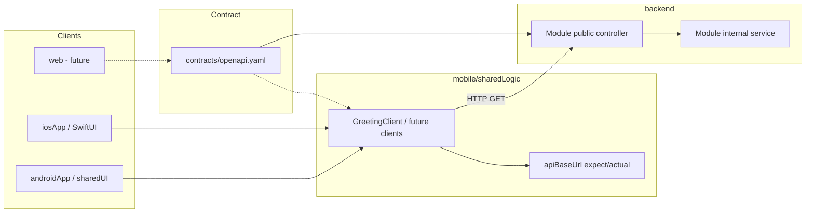

# Architecture

Long-lived design decisions for quickapp. Feature-specific detail lives in
`docs/specs/`; this document explains *how the repo is organized* and *how work
flows through it*.

## What this repo is

quickapp is an **SDD (spec-driven development) infrastructure repo**, not a
shipped product. The `greeting` backend module and mobile demo UI are disposable
harnesses used to prove the toolchain. Real apps reuse the same patterns:
spec → contract → backend module → mobile client → native UI.

Three checkpoints are verified in git:

| Checkpoint | Proves |
|------------|--------|
| 1 | Gradle + Spring Modulith backend (Java 25, `ModularityTests`) |
| 2 | KMP `sharedLogic` callable from native Android and iOS |
| 3 | Full cross-stack path: OpenAPI → REST endpoint → Ktor client → native UI |

See `docs/specs/archive/kmp-networking-spike.md` for checkpoint 3 evidence.

## Repository layout

```
quickapp/
├── backend/              # Spring Boot app + Modulith modules (root Gradle build)
│   └── modules/*         # One folder = one vertical slice (auto-discovered)
├── mobile/               # Separate Gradle build (KMP)
│   ├── sharedLogic/      # Shared business logic + networking
│   ├── sharedUI/         # Compose Multiplatform (Android uses this today)
│   ├── androidApp/       # Jetpack Compose shell
│   └── iosApp/           # Native SwiftUI shell (Xcode project)
├── contracts/
│   └── openapi.yaml      # API source of truth
├── build-logic/          # Backend convention plugins
├── docs/
│   ├── architecture.md   # ← this file
│   └── specs/            # active/ + archive/
└── web/                  # Not yet created
```

**Two independent Gradle builds**, one git repo. Backend root is the repo root;
mobile is under `mobile/`. They share no Gradle code — only `contracts/openapi.yaml`
connects them.

## SDD workflow

```
/spec  →  /implement (one task at a time)  →  commit at layer boundaries  →  archive spec
```

1. **Spec** — Copy `docs/specs/_template.md` to `docs/specs/active/<feature>.md`.
   Write problem, non-goals, acceptance criteria, and tasks by layer. Do not
   implement until the spec is approved.

2. **Checkpoint commit** — Before any multi-file change:
   `git commit -m "checkpoint: before <feature-name>"`.

3. **Implement** — One unchecked task at a time (`/implement`). Each task includes
   its test; run the relevant suite before checking the box.

4. **Commit at layer boundaries** — Natural split points:
   - backend + contract
   - mobile `sharedLogic`
   - platform UI wiring (Android / iOS)
   - spec archive

5. **Close out** — Manual smoke where needed, check off acceptance criteria,
   move spec to `docs/specs/archive/`.

Cursor rules in `.cursor/rules/` enforce per-layer conventions; `AGENTS.md` is the
constitution (changes rarely).

## Cross-stack request flow



**Verified path today:** `GET /api/greeting?name={platform}` →
`{ "message": "Hello, {name}, from a Spring Modulith module." }`

## Backend (Spring Modulith)

- **Vertical slices** under `backend/modules/<name>/`, not horizontal layers.
- **`internal` sub-package** — invisible to other modules. Public APIs (controllers,
  DTOs, interfaces) live in the module's top-level package.
- **Cross-module communication** — Spring application events, not direct imports
  into another module's `internal` package.
- **Module discovery** — automatic from `backend/modules/`; do not edit
  `settings.gradle.kts` to add a module.
- **New module** — folder + `build.gradle.kts` with
  `plugins { id("quickapp.module-conventions") }` only; add extra deps in that
  file, not in the convention plugin (unless two+ modules need them).
- **Boundaries enforced by test** — `ModularityTests` calls
  `ApplicationModules.verify()`. Must pass before any backend PR merges.

### New endpoint checklist

1. Controller + response DTO in the module's **public** package.
2. Business logic in `internal`.
3. Update `contracts/openapi.yaml`.
4. Unit test for logic; `@SpringBootTest` + MockMvc integration test for the HTTP
   surface (Spring Boot 4 requires `spring-boot-starter-webmvc-test`).
5. Constructor injection only.

Run: `./gradlew :backend:test` and
`./gradlew :backend:test --tests ModularityTests`.

## Mobile (Kotlin Multiplatform)

### Layer responsibilities

| Layer | Owns |
|-------|------|
| `sharedLogic` | API clients, models, business logic, networking, `expect`/`actual` for platform config |
| `sharedUI` | Compose Multiplatform UI (Android uses this today; optional long-term) |
| `androidApp` | Android manifest, permissions, Compose entry (`MainActivity`) |
| `iosApp` | SwiftUI views, `Info.plist`, Xcode project |

**Rule:** HTTP calls live in `sharedLogic`, not in `androidApp` or `iosApp`.

### Networking pattern (established by kmp-networking-spike)

- **Ktor Client** — `ktor-client-core` + OkHttp (Android) + Darwin (iOS).
- **JSON** — kotlinx.serialization + Ktor ContentNegotiation.
- **Base URL** — `expect fun apiBaseUrl()` in commonMain:
  - Android emulator → `http://10.0.2.2:8080`
  - iOS simulator → `http://localhost:8080`
- **iOS Swift interop** — callback wrapper in `iosMain` (e.g. `GreetingBridge`)
  rather than exposing `suspend` directly to SwiftUI.
- **Dev-only cleartext HTTP** — Android `network_security_config.xml` (localhost +
  `10.0.2.2`); iOS ATS exception for `localhost` in `Info.plist`.

### Running locally

| Target | How |
|--------|-----|
| Backend | `./gradlew :backend:bootRun` (repo root) |
| Android | Open `mobile/` in Android Studio → run `androidApp` on emulator |
| iOS | Open `mobile/iosApp/iosApp.xcodeproj` in Xcode → run on simulator |

Manual success signal: UI shows `from a Spring Modulith module.` in the greeting
text (proves a real HTTP round-trip, not local `sayHello()`).

Run tests: `cd mobile && ./gradlew :sharedLogic:testAndroidHostTest :sharedLogic:iosSimulatorArm64Test`

## Contract-first API

- **Source of truth:** `contracts/openapi.yaml`
- **Current consumers:** mobile only (`web/` does not exist yet)
- **AGENTS.md rule:** never modify the contract without updating **both** web and
  mobile clients in the same change. Exception: spikes/features before `web/`
  exists must note the deferral in the spec non-goals.
- **Client implementation today:** hand-written Ktor clients in `sharedLogic`
  (OpenAPI codegen is a follow-up).

## Testing strategy

| Layer | Automated | Manual |
|-------|-----------|--------|
| Backend module logic | Unit tests | — |
| Backend HTTP | MockMvc integration test | `curl` against running server |
| Modulith boundaries | `ModularityTests` | — |
| sharedLogic client | Ktor `MockEngine` in `commonTest` | — |
| Platform config | `androidHostTest` / `iosTest` | — |
| Native UI | Compile (`assembleDebug`, `xcodebuild`) | Emulator/simulator smoke |

Never call work "done" without a passing test that would fail if the change were
reverted. Never weaken a test to make it pass.

## Git and build hygiene

- **`**/build/`** is gitignored. If build outputs appear in `git status`, they were
  committed before the ignore rule — remove with
  `git rm -r --cached <path>/build`.
- **Do not commit** Gradle problem reports or local IDE config.

## CI

Path-filtered GitHub Actions run on pull requests and pushes to `main`:

| Workflow | Paths | Job |
|----------|-------|-----|
| `.github/workflows/backend.yml` | `backend/**`, `build-logic/**`, `gradle/**`, root Gradle files, the workflow itself | `:backend:test` (JDK 25) on `ubuntu-latest` |
| `.github/workflows/mobile.yml` | `mobile/**`, the workflow itself | `:sharedLogic:testAndroidHostTest` + `:androidApp:assembleDebug` (JDK 21 + Android SDK) on `ubuntu-latest` |

Docs-only or unrelated-path changes do not start the irrelevant workflow.

### Operator setup (manual)

1. Push `main` to `origin` once the workflows are on the remote.
2. In GitHub → Settings → Branches, protect `main` with **classic** branch
   protection (rulesets on private personal repos may not enforce without a Team
   org):
   - Require a pull request before merging
   - Do not allow force pushes
   - Do not allow deletions
   - After each workflow has run at least once: optionally require status checks
     `backend` / `mobile` (job names in the YAML)
3. Land subsequent work via PRs; CI runs on the PR and again on push to `main`
   after merge.

### CI follow-ups (not in this pass)

- iOS CI (`macos-latest` / simulator tests)
- Web CI (when `web/` exists)
- Contract validation (Spectral + spec/implementation diff) — see below

## Not built yet

These are intentional gaps; add via spec when ready:

- `web/` client scaffold
- OpenAPI code generation for clients
- Contract validation in CI (Spectral + spec/implementation diff)
- Postgres persistence, auth, production error handling
- Normalized network error messages in `sharedLogic` (iOS Darwin errors are verbose)

## When to add contract validation in CI

Add when **any** of these becomes true:

1. `web/` exists and consumes the same OpenAPI spec
2. OpenAPI codegen is adopted for mobile or web
3. A second endpoint/module makes manual alignment error-prone

Until then, `GreetingControllerIntegrationTest` + `GreetingClientTest` enforce
alignment for the single endpoint. First CI step when ready: Spectral on
`contracts/openapi.yaml` for validity/style.

## Adding a real feature (checklist)

Use this after the harness is no longer sufficient:

1. `/spec <feature-name>` — scope, non-goals, acceptance criteria, tasks by layer.
2. If the API changes: update `contracts/openapi.yaml` first (or in the same PR as
   backend + all consumers).
3. Backend: new module or extend existing slice; controller public, logic `internal`.
4. Mobile: new or extended client in `sharedLogic`; wire UI on each platform.
5. Web: required before merge if contract changed (once `web/` exists).
6. Tests at each layer; manual smoke if UI/network involved.
7. Archive spec to `docs/specs/archive/` when acceptance criteria are met.

## Conventions (accumulate here)

Add an entry only after the same mistake happens twice (per AGENTS.md). Initial
entries from verified spikes:

- **Spring Boot 4 MockMvc** — use `spring-boot-starter-webmvc-test`; import
  `@AutoConfigureMockMvc` from `org.springframework.boot.webmvc.test.autoconfigure`.
- **Spring Boot 4 `@RequestParam`** — use explicit names (`@RequestParam("name")`)
  unless `-parameters` compiler flag is enabled project-wide.
- **Layer-boundary commits** — backend+contract, then sharedLogic, then platform UI.
